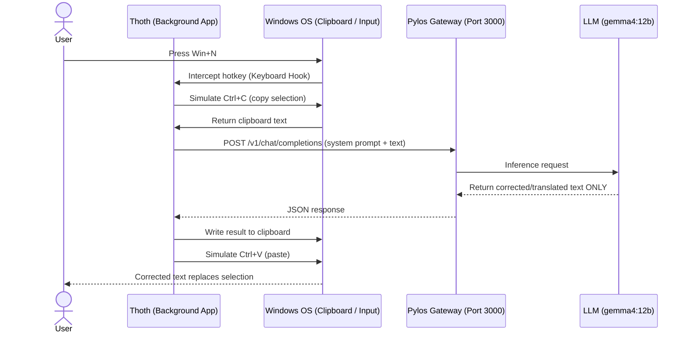
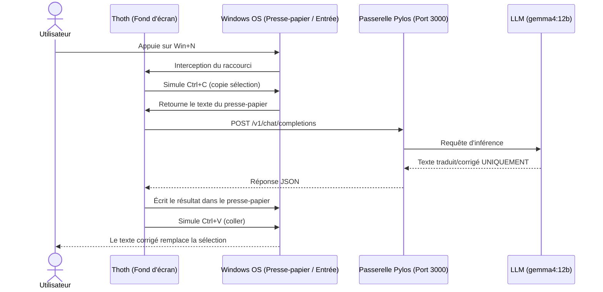

# 🦉 Thoth

> **Instant translation & grammar correction for Windows.**  
> **Traduction et correction instantanées pour Windows.**

---

## English

**Thoth** is a lightweight Windows background application written in Rust that provides instant translation and grammar correction via a global hotkey (`Win+N`). It works in any application — select text, press the hotkey, and the selected text is replaced by its translated/corrected version.

### Features

- **Global Hotkey (`Win+N`)** — trigger from any text input field
- **Automatic Copy/Paste** — simulates `Ctrl+C` / `Ctrl+V` to grab and replace text
- **LLM-powered Translation** — sends text to a local [Pylos](https://github.com/JZacharie/Pylos) gateway, which relays to any LLM (default: `gemma4:12b`)
- **Model Fallback** — automatically retries with a secondary model if the primary fails
- **10 Target Languages** — French, English, Spanish, German, Italian, Portuguese, Dutch, Japanese, Chinese, Russian
- **Sensitive Data Protection** — blocks API keys, JWTs, private keys, and credit card numbers
- **Clipboard Preservation** — original clipboard content is restored after each operation
- **System Tray Menu** — enable/disable, auto-start with Windows, usage statistics, quit
- **Usage Metrics** — tracks translations, errors, latency, and per-model usage (persisted as JSON)
- **Windows Toast Notifications** — success, error, and warning alerts
- **Configurable Hotkey** — customizable key combination (e.g., `Ctrl+Shift+T`, `Alt+Space`)
- **Auto-Start** — register for automatic launch at Windows boot
- **Hot-Reload Configuration** — config changes apply without restarting the app

### How it Works



### Architecture

```
┌────────────────────────────────────────────────────────────────┐
│  Thoth (Windows Background Process)                            │
│                                                                │
│  ┌──────────┐   ┌──────────────┐   ┌──────────────┐           │
│  │  Hotkey   │──▶│ Orchestrator │──▶│ Pylos Client │──HTTP───▶│
│  │ Listener  │   │  (main loop) │   │  (reqwest)   │  POST    │
│  └──────────┘   │              │   └──────────────┘           │
│                 │  ┌──────────┐ │                              │
│                 │  │Clipboard │ │          ┌──────────────┐    │
│                 │  │ Manager  │ │          │   Pylos      │──▶▶│
│  ┌──────────┐   │  │(arboard) │ │          │   Gateway    │ LLM│
│  │  Tray    │   │  └──────────┘ │          │  (port 3000) │    │
│  │  (tray-  │   └──────────────┘          └──────────────┘    │
│  │   icon)  │                                                 │
│  └──────────┘   ┌──────────────┐   ┌──────────────┐           │
│  ┌──────────┐   │  Metrics     │   │ Notifications│           │
│  │  Auto-   │   │  (JSON file) │   │(notify-rust) │           │
│  │  Start   │   └──────────────┘   └──────────────┘           │
│  └──────────┘                                                 │
└────────────────────────────────────────────────────────────────┘
```

### Prerequisites

- **Windows 10/11** (x86_64)
- **Rust** toolchain ([rustup.rs](https://rustup.rs/))
- A running instance of [**Pylos**](https://github.com/JZacharie/Pylos) (LLM gateway, typically on port `3000`)

### Quick Start

```bash
# Clone & build
git clone https://github.com/JZacharie/Thoth.git
cd Thoth
cargo build --release

# Run (Pylos must be running on port 3000)
./target/release/thoth.exe
```

### Configuration

Auto-generated on first run at `%APPDATA%/thoth/config.toml`:

```toml
[pylos]
endpoint = "http://localhost:3000"
model = "gemma4:12b"
fallback_model = "gemini4:12b"
timeout_secs = 10
secret = ""                              # Auto-generated if empty

[behavior]
target_language = "fr"
restore_clipboard = true
show_notifications = true
debounce_ms = 500
hotkey = "Win+N"
```

Supported hotkey patterns: `Win`, `Ctrl`, `Alt`, `Shift` + letter (A-Z), number (0-9), `Space`, or `F1`-`F12`.
Target languages: `fr`, `en`, `es`, `de`, `it`, `pt`, `nl`, `ja`, `zh`, `ru`.

### Logging

```bash
RUST_LOG=debug ./target/release/thoth.exe
RUST_LOG=thoth=trace ./target/release/thoth.exe
```

Default level is `info`.

### Project Structure

| File | Module | Purpose |
|---|---|---|
| `src/main.rs` | — | Entry point, Tokio runtime |
| `src/lib.rs` | `thoth` | Public API re-exports |
| `src/config.rs` | `config` | TOML config loading/saving |
| `src/orchestrator.rs` | `orchestrator` | Main event loop |
| `src/clipboard.rs` | `clipboard` | Clipboard read/write + Ctrl+C/V simulation |
| `src/pylos_client.rs` | `pylos_client` | Pylos HTTP client, prompt, sensitive data filter |
| `src/hotkey.rs` | `hotkey` | Global keyboard hook, pattern parsing |
| `src/tray.rs` | `tray` | System tray icon & menu |
| `src/notification.rs` | `notification` | Windows toast notifications |
| `src/metrics.rs` | `metrics` | Usage statistics (JSON) |
| `src/auto_start.rs` | `auto_start` | Windows Registry auto-start |
| `tests/integration.rs` | — | Integration tests (wiremock) |
| `installer/Thoth.wxs` | — | WiX MSI installer definition |

### CI/CD Pipeline

| Job | What | Trigger |
|---|---|---|
| `lint` | actionlint + typos | All pushes |
| `check` | fmt + clippy + tests + cargo-deny | All pushes |
| `msrv` | Rust 1.85.0 compatibility | All pushes |
| `build` | Release binary + artifact | All pushes |
| `msi` | Nightly MSI installer | Push to `main` |
| `sign` | Authenticode code signing | Tags `v*` |
| `release` | GitHub Release with assets | Tags `v*` |

### License

MIT — see [LICENSE](LICENSE).

---

## Français

**Thoth** est une application système légère écrite en **Rust** pour **Windows**. Elle agit comme un assistant de traduction et correction instantané via un raccourci clavier global (`Win+N`). Sélectionnez du texte dans n'importe quelle application, appuyez sur le raccourci, et le texte est remplacé par sa version traduite/corrigée.

### Fonctionnalités

- **Raccourci Global (`Win+N`)** — déclenchement depuis n'importe quel champ de saisie
- **Copier/Coller Automatique** — simule `Ctrl+C` / `Ctrl+V` pour intercepter et remplacer le texte
- **Traduction par LLM** — envoi à une passerelle [Pylos](https://github.com/JZacharie/Pylos) locale qui relaie vers le LLM (défaut : `gemma4:12b`)
- **Modèle de Secours** — tentative automatique avec un second modèle si le principal échoue
- **10 Langues Cibles** — français, anglais, espagnol, allemand, italien, portugais, néerlandais, japonais, chinois, russe
- **Protection des Données Sensibles** — blocage des clés API, JWT, clés privées, numéros de carte bancaire
- **Préservation du Presse-papier** — le contenu original est restauré après chaque opération
- **Menu dans la Barre d'État** — activer/désactiver, démarrer avec Windows, statistiques, quitter
- **Métriques d'Utilisation** — traductions, erreurs, latence, usage par modèle (fichier JSON)
- **Notifications Toast Windows** — alertes de succès, erreur et avertissement
- **Raccourci Configurable** — combinaison de touches personnalisable (ex: `Ctrl+Shift+T`, `Alt+Space`)
- **Démarrage Automatique** — inscription au registre Windows pour un lancement au boot
- **Configuration à Chaud** — les modifications du fichier de config sont appliquées sans redémarrage

### Fonctionnement



### Architecture

```
┌────────────────────────────────────────────────────────────────┐
│  Thoth (Processus Windows en arrière-plan)                     │
│                                                                │
│  ┌──────────┐   ┌──────────────┐   ┌──────────────┐           │
│  │  Hotkey  │──▶│ Orchestrateur│──▶│Client Pylos  │──HTTP───▶│
│  │ (rdev)   │   │(boucle princ)│   │  (reqwest)   │  POST    │
│  └──────────┘   │              │   └──────────────┘           │
│                 │  ┌──────────┐ │                              │
│                 │  │Presse-   │ │       ┌──────────────┐      │
│                 │  │papier    │ │       │  Pylos       │──▶▶  │
│  ┌──────────┐   │  │(arboard) │ │       │  (port 3000) │ LLM  │
│  │  Tray    │   │  └──────────┘ │       └──────────────┘      │
│  │(tray-icon)└──┘              ┘                               │
│  └──────────┘   ┌──────────────┐   ┌──────────────┐           │
│  ┌──────────┐   │  Métriques   │   │Notifications │           │
│  │  Auto-   │   │ (fichier JSON)│   │(notify-rust) │           │
│  │  Start   │   └──────────────┘   └──────────────┘           │
│  └──────────┘                                                 │
└────────────────────────────────────────────────────────────────┘
```

### Prérequis

- **Windows 10/11** (x86_64)
- **Rust** (via [rustup.rs](https://rustup.rs/))
- Une instance de [**Pylos**](https://github.com/JZacharie/Pylos) en cours d'exécution (port `3000`)

### Démarrage Rapide

```bash
# Cloner & compiler
git clone https://github.com/JZacharie/Thoth.git
cd Thoth
cargo build --release

# Lancer (Pylos doit être actif sur le port 3000)
./target/release/thoth.exe
```

### Configuration

Générée automatiquement au premier lancement dans `%APPDATA%/thoth/config.toml` :

```toml
[pylos]
endpoint = "http://localhost:3000"
model = "gemma4:12b"
fallback_model = "gemini4:12b"
timeout_secs = 10
secret = ""

[behavior]
target_language = "fr"
restore_clipboard = true
show_notifications = true
debounce_ms = 500
hotkey = "Win+N"
```

Raccourcis supportés : `Win`, `Ctrl`, `Alt`, `Shift` + lettre (A-Z), chiffre (0-9), `Space`, ou `F1`-`F12`.
Langues cibles : `fr`, `en`, `es`, `de`, `it`, `pt`, `nl`, `ja`, `zh`, `ru`.

### Journaux (logs)

```bash
RUST_LOG=debug ./target/release/thoth.exe
RUST_LOG=thoth=trace ./target/release/thoth.exe
```

Le niveau par défaut est `info`.

### Structure du Projet

| Fichier | Module | Rôle |
|---|---|---|
| `src/main.rs` | — | Point d'entrée, runtime Tokio |
| `src/lib.rs` | `thoth` | Ré-exportations de l'API publique |
| `src/config.rs` | `config` | Chargement/sauvegarde de la config TOML |
| `src/orchestrator.rs` | `orchestrator` | Boucle événementielle principale |
| `src/clipboard.rs` | `clipboard` | Lecture/écriture presse-papier + simulation Ctrl+C/V |
| `src/pylos_client.rs` | `pylos_client` | Client HTTP Pylos, prompt, filtre sensible |
| `src/hotkey.rs` | `hotkey` | Hook clavier global, parsing de pattern |
| `src/tray.rs` | `tray` | Icône et menu dans la barre d'état |
| `src/notification.rs` | `notification` | Notifications Toast Windows |
| `src/metrics.rs` | `metrics` | Statistiques d'utilisation (JSON) |
| `src/auto_start.rs` | `auto_start` | Démarrage automatique (registre Windows) |
| `tests/integration.rs` | — | Tests d'intégration (wiremock) |
| `installer/Thoth.wxs` | — | Définition de l'installateur MSI WiX |

### Pipeline CI/CD

| Job | Quoi | Déclencheur |
|---|---|---|
| `lint` | actionlint + typos | Tous les pushes |
| `check` | fmt + clippy + tests + cargo-deny | Tous les pushes |
| `msrv` | Compatibilité Rust 1.85.0 | Tous les pushes |
| `build` | Binaire Release + artifact | Tous les pushes |
| `msi` | Installateur MSI nightly | Push sur `main` |
| `sign` | Signature Authenticode | Tags `v*` |
| `release` | GitHub Release avec assets | Tags `v*` |

### Licence

MIT — voir [LICENSE](LICENSE).
