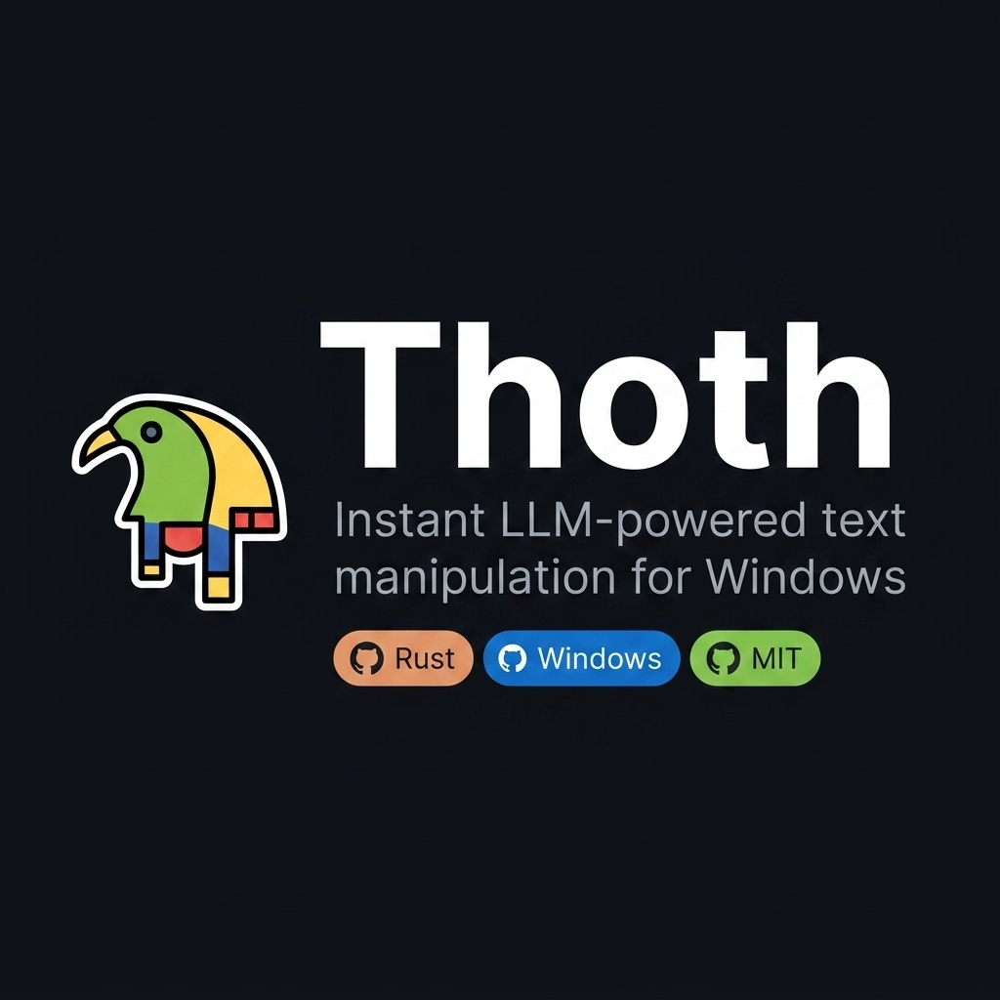
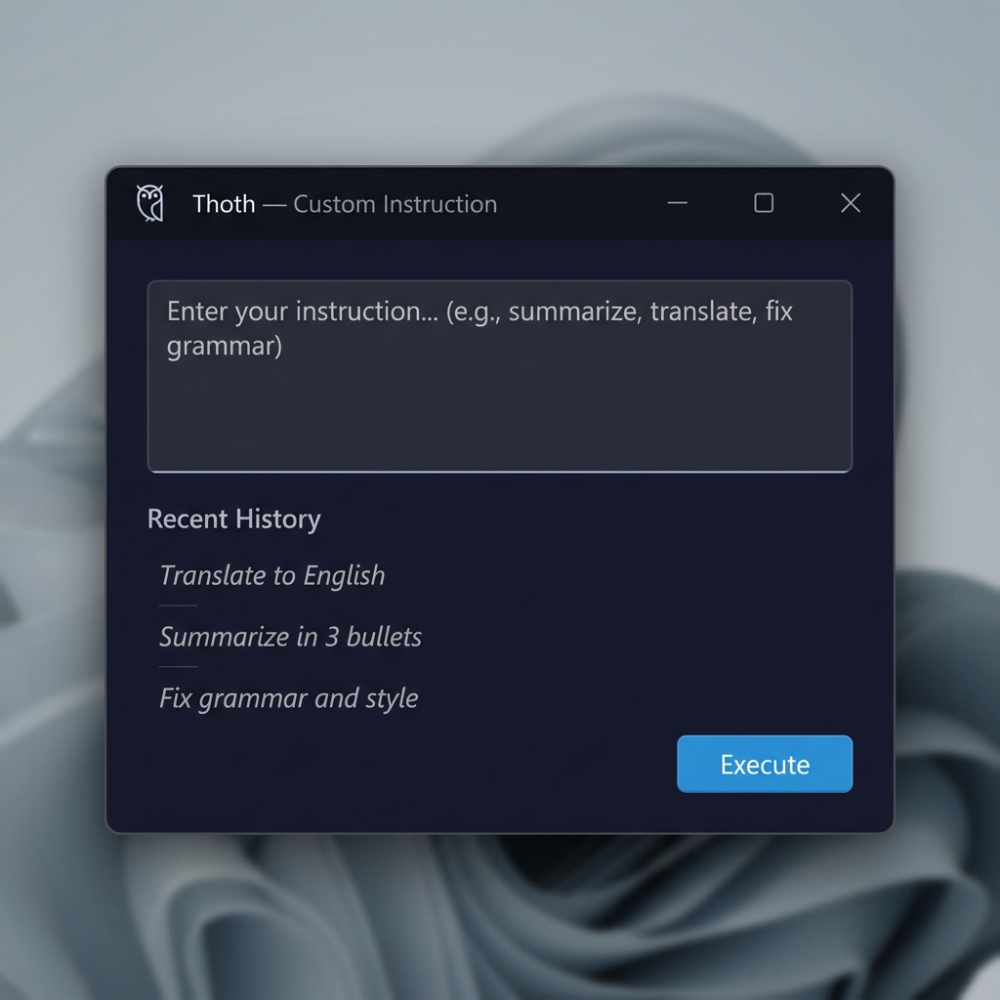
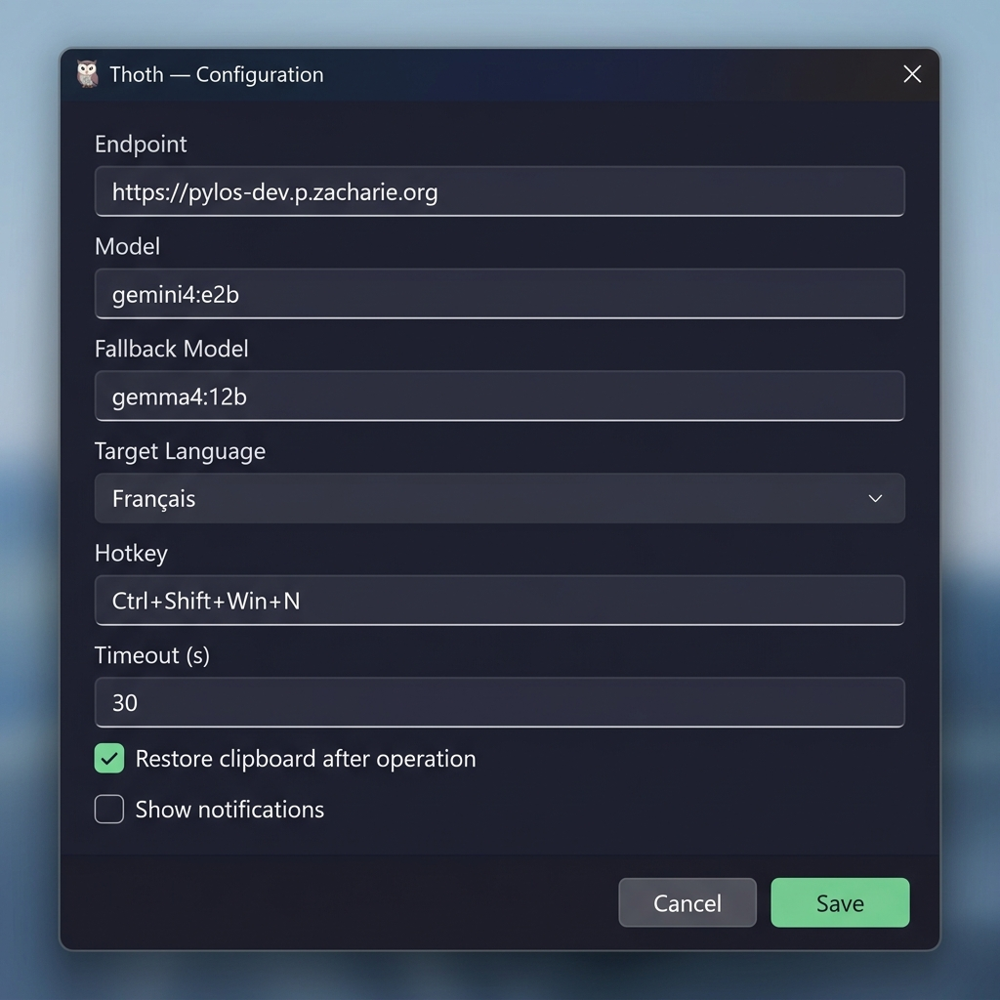
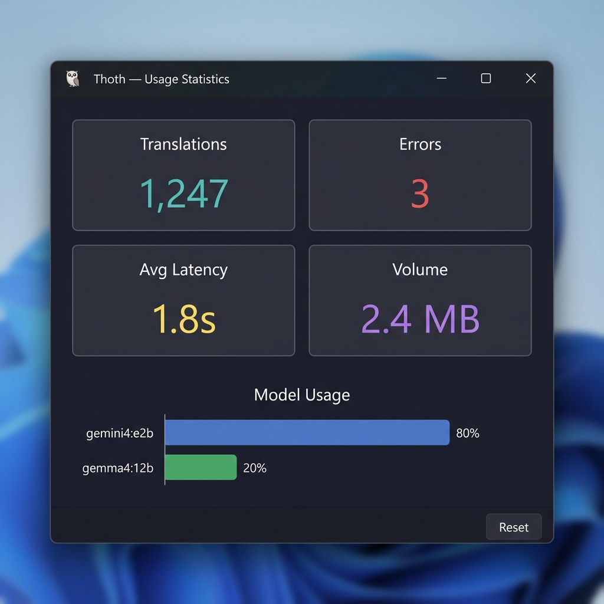
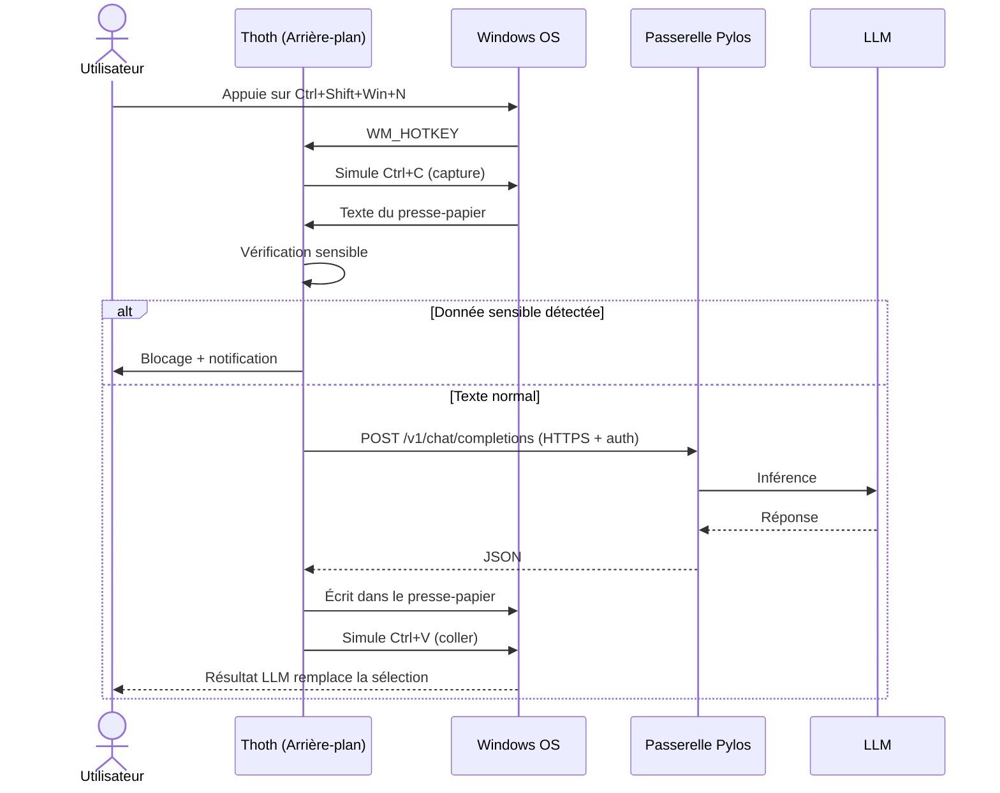

# 🦉 Thoth

<p align="center">
  
</p>

> **Instant LLM-powered text manipulation for Windows — translate, reformulate, or execute custom prompts via global hotkeys.**  
> **Manipulation de texte instantanée par LLM pour Windows — traduire, reformuler ou exécuter des instructions personnalisées via des raccourcis globaux.**

---

## English

**Thoth** is a lightweight Windows background application written in **Rust** that provides instant LLM-powered text manipulation — translation, reformulation, or custom prompts — via global hotkeys. Select text in any application, press a hotkey, and the text is replaced by the LLM response.

### Features

#### Core
- **4 Global Hotkeys** — configurable hotkey set; default: translate (`Ctrl+Shift+Win+N`), translate to English (`Ctrl+Shift+Win+,`), custom prompt GUI overlay (`Ctrl+Shift+Win+:`), reformulate (`Ctrl+Shift+Win+R`)
- **Automatic Copy/Paste** — simulates `Ctrl+C` / `Ctrl+V` to capture and replace text in any application
- **10 Target Languages** — French, English, Spanish, German, Italian, Portuguese, Dutch, Japanese, Chinese, Russian

#### GUI (Native eframe/egui Windows)
- **Prompt GUI** — executes custom user instruction on selected text, with history persistence (up/down arrows + click selection), saved in Windows Registry
- **Config Editor** — edit all settings directly in-app (endpoint, model, hotkey, language, etc.)
- **Statistics Dashboard** — view translations count, errors, volume processed, average latency, per-model usage

<p align="center">
  &nbsp;&nbsp;
  
</p>
<p align="center">
  <em>Left: Custom Instruction overlay &nbsp;|&nbsp; Right: Configuration Editor</em>
</p>

#### Security
- **DPAPI-Encrypted Configuration** — config is encrypted with Windows `CryptProtectData` and stored in `HKCU\Software\Thoth\Config` (REG_BINARY); no plaintext files on disk
- **Enforced HTTPS** — non-localhost endpoints are automatically upgraded to `https://`; bypassable via `--insecure` flag for local development
- **Authenticode Signature Verification** — `WinVerifyTrust` validates binary signature at startup (release builds only); execution is blocked if signature is invalid
- **Sensitive Data Detection** — blocks requests containing API keys (OpenAI `sk-`, `pk-`, AWS `AKIA`, GitHub `ghp_/gho_/ghu_/ghs_/ghr_`), JWTs, private keys (`-----BEGIN * PRIVATE KEY-----`), credit card numbers, Slack tokens (`xoxb-`, `xoxp-`), database URIs (`mongodb://`, `postgres://`, `mysql://`)
- **Clipboard Preservation** — original clipboard content is restored after each operation

#### Reliability
- **Model Fallback** — auto-retries with secondary model if primary fails
- **Configurable Timeout** — adjustable request timeout (default 30s)
- **Panic Handler** — native crash dialog with option to open log file

#### Observability
- **Redacted Logging** — never logs original or translated text; logs only lengths and content hashes
- **Usage Metrics** — tracks translations, errors, latency, per-model usage (persisted as JSON)
- **Windows Toast Notifications** — success, error, and warning alerts via `notify-rust`

### Hotkey Reference

| Action | Default Hotkey | Description |
|---|---|---|
| Translate (default lang) | `Ctrl+Shift+Win+N` | Translates selected text to configured target language |
| Translate to English | `Ctrl+Shift+Win+,` | Translates selected text to English |
| Custom Prompt | `Ctrl+Shift+Win+:` | Opens GUI overlay — enter instruction, press Enter, result is pasted |
| Reformulate | `Ctrl+Shift+Win+R` | Reformulates/rewrites selected text for clarity and style |

All hotkeys are configurable via `behavior.hotkey` in settings.

### How it Works

```mermaid
sequenceDiagram
    actor User
    participant Thoth as Thoth (Background)
    participant OS as Windows OS
    participant Pylos as Pylos Gateway
    participant LLM as LLM

    User->>OS: Press Ctrl+Shift+Win+N
    OS->>Thoth: WM_HOTKEY event
    Thoth->>OS: Simulate Ctrl+C (capture selection)
    OS->>Thoth: Return clipboard text
    Thoth->>Thoth: Check for sensitive data
    alt Sensitive data detected
        Thoth->>User: Block + warning notification
    else Clean text
        Thoth->>Pylos: POST /v1/chat/completions (HTTPS + auth header)
        Pylos->>LLM: Inference
        LLM-->>Pylos: Response
        Pylos-->>Thoth: JSON response
        Thoth->>OS: Write result to clipboard
        Thoth->>OS: Simulate Ctrl+V (paste)
        OS-->>User: LLM response replaces selection
    end
```



### Architecture

```
┌──────────────────────────────────────────────────────────────────┐
│  Thoth (Windows Background Process — Rust)                       │
│                                                                   │
│  ┌────────────┐   ┌──────────────┐   ┌───────────────────┐       │
│  │  Hotkey    │──▶│ Orchestrator │──▶│ Pylos Client      │──▶     │
│  │  Listener  │   │  (main loop) │   │  (reqwest, HTTPS) │  POST  │
│  │  (Register │   │              │   └───────────────────┘        │
│  │   HotKey)  │   │  ┌─────────┐ │           │                    │
│  └────────────┘   │  │Clipboard│ │           ▼                    │
│                   │  │ Manager │ │    ┌──────────────┐            │
│  ┌────────────┐   │  │(arboard)│ │    │   Pylos      │──▶▶ LLM   │
│  │  System    │   │  └─────────┘ │    │   Gateway    │            │
│  │  Tray      │   └──────────────┘    └──────────────┘            │
│  │  (tray-    │                                                    │
│  │   icon)    │   ┌──────────────┐   ┌──────────────┐             │
│  └────────────┘   │  Metrics     │   │ Notifications│             │
│                   │  (JSON file) │   │(notify-rust) │             │
│  ┌────────────┐   └──────────────┘   └──────────────┘             │
│  │  Eframe    │                                                    │
│  │  GUI       │   ┌──────────────────────────────────────┐        │
│  │  (native)  │   │  Windows DPAPI (CryptProtectData)     │        │
│  └────────────┘   │  → HKCU\Software\Thoth\Config        │        │
│                   │  → HKCU\Software\Thoth\History       │        │
│                   └──────────────────────────────────────┘        │
└──────────────────────────────────────────────────────────────────┘
```

<p align="center">
  
</p>
<p align="center">
  <em>Statistics Dashboard — usage metrics, latency and per-model breakdown</em>
</p>

### Prerequisites

- **Windows 10/11** (x86_64) — the only supported platform
- **Rust** toolchain (1.88+) — [rustup.rs](https://rustup.rs/)
- A running instance of **Pylos** gateway (typically on port 3000) or any OpenAI-compatible API endpoint

### Quick Start

```bash
# Clone & build
git clone https://github.com/JZacharie/Thoth.git
cd Thoth
cargo build --release

# Run background service
./target/release/thoth.exe

# Launch config editor
./target/release/thoth.exe --config

# Launch prompt GUI directly (no hotkey needed)
./target/release/thoth.exe --prompt

# View statistics
./target/release/thoth.exe --stats

# Allow self-signed certificates (local dev only)
./target/release/thoth.exe --insecure
```

### Configuration

Thoth auto-generates a configuration with secure defaults on first run. On Windows, config is **encrypted via DPAPI** and stored in the registry — no plaintext files on disk.

Default configuration (what is set on first run):

```toml
[pylos]
endpoint = "https://pylos-dev.p.zacharie.org"
model = "gemini4:e2b"
fallback_model = "gemma4:12b"
timeout_secs = 30
secret = "Auto-generated UUID"

[behavior]
target_language = "<system language>"
restore_clipboard = true
show_notifications = true
debounce_ms = 500
hotkey = "Ctrl+Shift+Win+N"
```

Configured hotkey patterns: `Win`, `Ctrl`, `Alt`, `Shift` + letter (A-Z), number (0-9), `Space`, `F1`-`F24`, `Comma`, `Semicolon`, `Colon`.

**To edit config:** run `thoth.exe --config` or use the tray menu → Configuration.

### CLI Flags

| Flag | Description |
|---|---|
| (none) | Starts background service with hotkey listener |
| `--prompt` | Opens the custom prompt GUI (overlay, always-on-top) |
| `--config` | Opens the configuration editor GUI |
| `--stats` | Opens the statistics dashboard GUI |
| `--insecure` | Disables HTTPS enforcement and TLS certificate verification |

### Logging

```bash
RUST_LOG=debug  ./target/release/thoth.exe
RUST_LOG=trace  ./target/release/thoth.exe
# Or per-module:
RUST_LOG=thoth=debug,hotkey=trace  ./target/release/thoth.exe
```

Default level is `info`. Logs are written to `thoth.log` next to the executable.
**Note:** Logs never contain original or translated text — only lengths and hashes.

### Project Structure

| File | Module | Purpose |
|---|---|---|
| `src/main.rs` | — | Entry point, Tokio runtime, CLI args, signature verification, panic handler |
| `src/lib.rs` | `thoth` | Public API re-exports; insecure mode global flag |
| `src/config.rs` | `config` | Config structs, DPAPI encryption, registry storage (HKCU\Software\Thoth) |
| `src/orchestrator.rs` | `orchestrator` | Main event loop: hotkey dispatch, text capture, LLM call, paste |
| `src/clipboard.rs` | `clipboard` | Clipboard read/write + Ctrl+C/V simulation (rdev) |
| `src/pylos_client.rs` | `pylos_client` | HTTP client, prompt builders, sensitive data filter, fallback logic |
| `src/hotkey.rs` | `hotkey` | Windows global hotkey registration (RegisterHotKey), pattern parsing |
| `src/gui.rs` | `gui` | eframe/egui native GUI: prompt with history, config editor, stats dashboard |
| `src/dialog.rs` | `dialog` | Minimal eframe prompt dialog (legacy entry point for prompt mode) |
| `src/tray.rs` | `tray` | System tray icon & menu (tray-icon crate) |
| `src/notification.rs` | `notification` | Windows toast notifications (notify-rust) |
| `src/metrics.rs` | `metrics` | Usage statistics persisted as JSON |
| `src/auto_start.rs` | `auto_start` | Windows Registry auto-start (HKCU\Run) |
| `tests/integration.rs` | — | Integration tests with wiremock (HTTP mocking) |

### Security Review

| Area | Status | Details |
|---|---|---|
| Config at rest | ✅ **DPAPI encrypted** | `CryptProtectData` → `HKCU\Software\Thoth\Config` REG_BINARY; plaintext file is migrated and deleted |
| Transport | ✅ **HTTPS enforced** | Non-localhost endpoints auto-upgraded to https://; TLS verified by default |
| Secrets in headers | ✅ **Dual auth** | `X-Thoth-Secret` + `Authorization: Bearer` sent on every request |
| Sensitive data | ✅ **Hardened detection** | API keys (OpenAI, AWS, GitHub), JWTs, SSH keys, credit cards, Slack tokens, DB URIs |
| Logs | ✅ **Redacted** | Only `(len: N, hash: 0x...)` logged — never the actual text |
| Binary integrity | ✅ **WinVerifyTrust** | `WinVerifyTrust` validates Authenticode signature at startup (release only) |
| Input validation | ✅ **Hotkey parser** | Strict parsing with clear error messages; no unchecked user input reaches the OS hotkey API |
| Code signing | ✅ **CI pipeline** | GitHub Actions signs binaries on tag pushes with Authenticode certificate |
| Process spawning | ✅ **Native GUI only** | All user interaction via eframe/egui native Win32 windows; no PowerShell or HTA |

### CI/CD Pipeline

| Job | What | Trigger |
|---|---|---|
| `lint` | actionlint + typos | All pushes |
| `check` | fmt + clippy + tests + cargo-deny | All pushes |
| `msrv` | Rust 1.88.0 compatibility | All pushes |
| `build` | Release binary + artifact | All pushes |
| `msi` | Nightly MSI installer (WiX) | Push to `main` |
| `sign` | Authenticode code signing | Tags `v*` |
| `release` | GitHub Release with assets | Tags `v*` |

### License

MIT — see [LICENSE](LICENSE).

---

## Français

**Thoth** est une application système légère écrite en **Rust** pour **Windows** qui permet la manipulation de texte instantanée via LLM — traduction, reformulation ou instructions personnalisées — grâce à des raccourcis clavier globaux. Sélectionnez du texte dans n'importe quelle application, appuyez sur un raccourci, et le texte est remplacé par la réponse du LLM.

### Fonctionnalités

#### Générales
- **4 Raccourcis Globaux** — jeu configurable ; défaut : traduire (`Ctrl+Shift+Win+N`), vers l'anglais (`Ctrl+Shift+Win+,`), console d'instruction personnalisée overlay (`Ctrl+Shift+Win+:`), reformuler (`Ctrl+Shift+Win+R`)
- **Copier/Coller Automatique** — simule `Ctrl+C` / `Ctrl+V` dans n'importe quelle application
- **10 Langues Cibles** — français, anglais, espagnol, allemand, italien, portugais, néerlandais, japonais, chinois, russe

#### GUI Native eframe/egui
- **Console Instruction** — exécute une instruction personnalisée sur le texte sélectionné, avec historique persistant (navigation flèches haut/bas + clic), sauvegardé dans le registre Windows
- **Éditeur de Configuration** — modifiez tous les paramètres directement dans l'application
- **Tableau de Bord Statistiques** — traductions, erreurs, volume, latence, usage par modèle

<p align="center">
  &nbsp;&nbsp;
  
</p>
<p align="center">
  <em>Gauche : Console d'instruction &nbsp;|&nbsp; Droite : Éditeur de configuration</em>
</p>

#### Sécurité
- **Configuration Chiffrée (DPAPI)** — config chiffrée via `CryptProtectData` dans `HKCU\Software\Thoth\Config` (REG_BINARY) ; plus aucun fichier en clair sur le disque
- **HTTPS Imposé** — les endpoints non-localhost sont automatiquement passés en `https://` ; flag `--insecure` pour le développement local
- **Vérification de Signature** — `WinVerifyTrust` valide la signature Authenticode au démarrage (release uniquement)
- **Détection de Données Sensibles** — blocage des clés API (OpenAI, AWS, GitHub), JWT, clés privées, cartes bancaires, tokens Slack, URIs de bases de données
- **Préservation du Presse-papier** — le contenu original est restauré après chaque opération

#### Fiabilité
- **Modèle de Secours** — tentative automatique avec un second modèle si le principal échoue
- **Timeout Configurable** — 30 secondes par défaut
- **Gestion de Panique** — dialogue d'erreur natif avec option d'ouverture du fichier de log

#### Observabilité
- **Journaux Caviardés** — aucun texte utilisateur ou LLM dans les logs ; seules les tailles et empreintes sont conservées
- **Métriques d'Utilisation** — traductions, erreurs, latence, usage par modèle (JSON)
- **Notifications Toast Windows** — succès, erreur et avertissement

### Raccourcis

| Action | Raccourci par défaut | Description |
|---|---|---|
| Traduire (langue cible) | `Ctrl+Shift+Win+N` | Traduit le texte sélectionné vers la langue configurée |
| Traduire en anglais | `Ctrl+Shift+Win+,` | Traduit le texte sélectionné en anglais |
| Instruction personnalisée | `Ctrl+Shift+Win+:` | Ouvre l'overlay GUI — saisissez l'instruction, Entrée valide |
| Reformuler | `Ctrl+Shift+Win+R` | Reformule/réécrit le texte pour plus de clarté et de style |

Tous les raccourcis sont configurables via `behavior.hotkey`.

### Fonctionnement



### Architecture

```
┌──────────────────────────────────────────────────────────────────┐
│  Thoth (Processus Windows — Rust)                                │
│                                                                   │
│  ┌────────────┐   ┌──────────────┐   ┌───────────────────┐       │
│  │ Hotkey     │──▶│ Orchestrateur│──▶│ Client Pylos      │──▶     │
│  │ (Register  │   │(boucle princ)│   │ (reqwest, HTTPS)  │  POST │
│  │  HotKey)   │   │              │   └───────────────────┘        │
│  └────────────┘   │  ┌─────────┐ │           │                    │
│                   │  │Presse-   │ │           ▼                    │
│  ┌────────────┐   │  │papier   │ │    ┌──────────────┐            │
│  │  Tray      │   │  │(arboard)│ │    │   Pylos      │──▶▶ LLM   │
│  │  (tray-    │   │  └─────────┘ │    │   Gateway    │            │
│  │   icon)    │   └──────────────┘    └──────────────┘            │
│  └────────────┘                                                    │
│                   ┌──────────────┐   ┌──────────────┐             │
│  ┌────────────┐   │  Métriques   │   │Notifications │             │
│  │  GUI       │   │  (JSON)      │   │(notify-rust) │             │
│  │  eframe/   │   └──────────────┘   └──────────────┘             │
│  │  egui      │                                                    │
│  └────────────┘   ┌──────────────────────────────────────┐        │
│                   │  Windows DPAPI (CryptProtectData)     │        │
│                   │  → HKCU\Software\Thoth\Config        │        │
│                   │  → HKCU\Software\Thoth\History       │        │
│                   └──────────────────────────────────────┘        │
└──────────────────────────────────────────────────────────────────┘
```

### Prérequis

- **Windows 10/11** (x86_64) — plateforme unique supportée
- **Rust** 1.88+ — [rustup.rs](https://rustup.rs/)
- Une instance de la passerelle **Pylos** en cours d'exécution

### Démarrage Rapide

```bash
# Cloner & compiler
git clone https://github.com/JZacharie/Thoth.git
cd Thoth
cargo build --release

# Lancer le service d'arrière-plan
./target/release/thoth.exe

# Éditeur de configuration
./target/release/thoth.exe --config

# Console d'instruction directement
./target/release/thoth.exe --prompt

# Statistiques
./target/release/thoth.exe --stats

# Certificats auto-signés (dev local uniquement)
./target/release/thoth.exe --insecure
```

### Configuration

Thoth génère une configuration avec des valeurs par défaut sécurisées au premier lancement. Sur Windows, la configuration est **chiffrée via DPAPI** et stockée dans le registre — aucun fichier en clair.

Configuration par défaut :

```toml
[pylos]
endpoint = "https://pylos-dev.p.zacharie.org"
model = "gemini4:e2b"
fallback_model = "gemma4:12b"
timeout_secs = 30
secret = "UUID auto-généré"

[behavior]
target_language = "<langue système>"
restore_clipboard = true
show_notifications = true
debounce_ms = 500
hotkey = "Ctrl+Shift+Win+N"
```

**Éditer la config :** `thoth.exe --config` ou menu tray → Configuration.

### Structure du Projet

| Fichier | Module | Rôle |
|---|---|---|
| `src/main.rs` | — | Point d'entrée, runtime Tokio, args CLI, vérification signature |
| `src/lib.rs` | `thoth` | Ré-exportations, flag global insecure |
| `src/config.rs` | `config` | Structures, chiffrement DPAPI, stockage registre |
| `src/orchestrator.rs` | `orchestrator` | Boucle principale : dispatch hotkey, capture, LLM, collage |
| `src/clipboard.rs` | `clipboard` | Lecture/écriture presse-papier + simulation Ctrl+C/V |
| `src/pylos_client.rs` | `pylos_client` | Client HTTP, prompts, filtre sensible, fallback |
| `src/hotkey.rs` | `hotkey` | Enregistrement hotkey Windows, parsing |
| `src/gui.rs` | `gui` | GUI native eframe/egui : prompt avec historique, config, stats |
| `src/dialog.rs` | `dialog` | Mini dialogue eframe (point d'entrée legacy) |
| `src/tray.rs` | `tray` | Icône et menu barre d'état |
| `src/notification.rs` | `notification` | Notifications Toast Windows |
| `src/metrics.rs` | `metrics` | Statistiques d'utilisation (JSON) |
| `src/auto_start.rs` | `auto_start` | Démarrage automatique (registre Windows) |
| `tests/integration.rs` | — | Tests d'intégration avec wiremock |

### Licence

MIT — voir [LICENSE](LICENSE).
