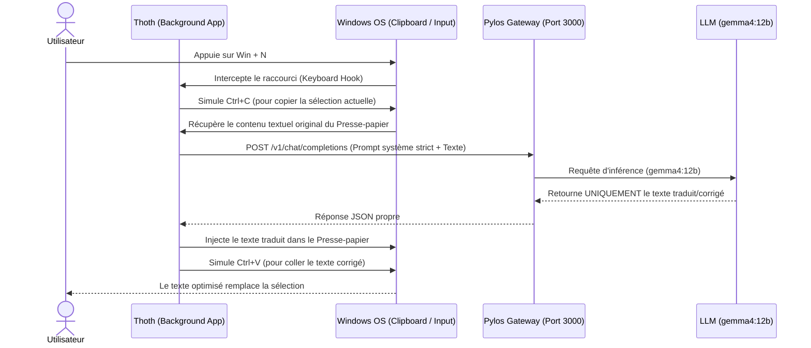

# 🦉 Thoth

**Thoth** est une application système légère écrite en **Rust**, conçue spécifiquement pour **Windows**. Elle agit comme un assistant de traduction et d'écriture instantané en interceptant, corrigeant et améliorant à la volée le texte sélectionné via un raccourci clavier global dédié (`Win + N`).

---

## 🚀 Fonctionnalités

*   **Raccourci Clavier Global (`Win + N`)** : Déclenchez le traitement instantanément depuis n'importe quel champ de saisie sous Windows.
*   **Copie Automatique** : Lors de l'activation, Thoth copie automatiquement le texte actuellement sélectionné.
*   **Intégration Pylos** : Le texte est envoyé à la passerelle locale **Pylos** qui relaie la requête au modèle LLM cible.
*   **Modèle `gemma4:12b`** : Utilisation du modèle `gemma4:12b` (ou `gemini4:12b`) pour effectuer la traduction, la correction grammaticale et l'optimisation du sens de manière concise et naturelle.
*   **Prompt Système Strict** : Un prompt système rigoureux oblige le modèle à ne renvoyer **que le texte final traduit/corrigé**, sans aucune phrase d'introduction, explication, ni mise en forme superflue (évitant ainsi de coller des compléments textuels indésirables).
*   **Remplacement Instantané** : Le presse-papier est mis à jour et le texte optimisé est automatiquement collé à l'emplacement du curseur.

---

## 🛠️ Comment ça marche ?



---

## ⚙️ Prérequis & Configuration

### Prérequis

*   **Windows 10/11**
*   **Rust** (via [rustup](https://rustup.rs/))
*   Une instance locale de **Pylos** en cours d'exécution (généralement sur le port `3000`).

### Configuration du Prompt Système (System Prompt)

Pour garantir qu'aucun commentaire du LLM n'apparaisse dans le collage final, le prompt système suivant est utilisé :

```text
Tu es un traducteur et correcteur de texte ultra-précis.
Ta tâche est de traduire, corriger l'orthographe/grammaire et rendre le texte fourni clair et concis.
Tu dois UNIQUEMENT retourner le texte corrigé et traduit. 
Ne commence JAMAIS ta réponse par des formules de politesse, des introductions (ex: "Voici la traduction :") ou des explications. 
Ne mets pas de guillemets ou de blocs de code markdown autour de ta réponse, sauf s'ils faisaient partie du texte d'origine.
```

---

## 📦 Dépendances clés envisagées

*   [`rdev`](https://crates.io/crates/rdev) ou [`inputbot`](https://crates.io/crates/inputbot) pour l'écoute globale du clavier.
*   [`arboard`](https://crates.io/crates/arboard) pour la lecture/écriture dans le presse-papier Windows.
*   [`reqwest`](https://crates.io/crates/reqwest) pour requêter l'API locale de Pylos.
*   [`tokio`](https://crates.io/crates/tokio) pour l'asynchronisme.

---

## 📝 Licence

Ce projet est sous licence MIT. Voir le fichier [LICENSE](LICENSE) pour plus de détails.