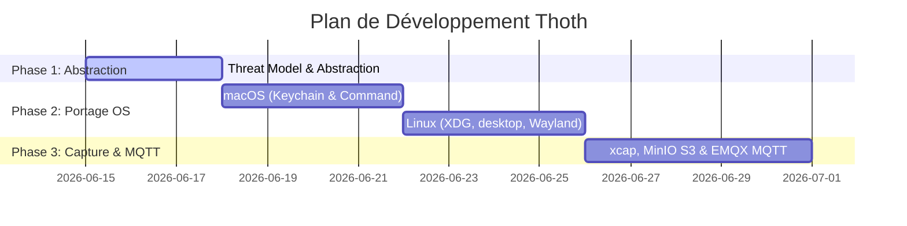

# Plan de Développement pour les Agents de Codage (Thoth)

Ce document fournit un plan de développement étape par étape conçu pour être exécuté par des agents de codage autonomes (comme SecureCoder ou d'autres assistants IA). Il intègre les directives d'utilisation des **Skills** de sécurité à chaque phase clé pour garantir un développement rapide, robuste et sans faille de sécurité.

---

## 🛠️ Phases de Développement et Skills Associés

---

## Phase 1 : Abstraction Multi-OS et Sécurisation
*Objectif : Préparer le terrain en éliminant les dépendances Win32 en dur et en posant les bases de la sécurité.*

### 📋 Tâches
1. **Création du plan de sécurité initial :** Définir les frontières de confiance pour les flux réseau et le stockage local.
2. **Refactoring Multiplateforme :** Remplacer `MessageBoxW` par `rfd` et `Config::path()` par la caisse `directories`.
3. **Mise en place de GitLeaks :** Intégrer le scan de secrets dans `.github/workflows/ci.yml`.

### 🛡️ Skills Obligatoires à Appeler par l'Agent :
*   **`determine-threat-model` :** À exécuter au début de la phase pour cartographier les risques d'exposition de la configuration et des logs.
*   **`scan_dependencies` :** À lancer **avant** d'ajouter `rfd`, `directories` ou `keyring` au `Cargo.toml`.
*   **`create-security-implementation-plan` :** Produire le plan de vérification de sécurité décrivant comment les clés seront protégées localement.

---

## Phase 2 : Portage de Thoth (macOS & Linux)
*Objectif : Rendre le service d'arrière-plan compilable et opérationnel sur Apple macOS et Linux (X11/Wayland).*

### 📋 Tâches
1. **Gestion des raccourcis clavier :** Intégrer la caisse `global-hotkey` à la place de `RegisterHotKey`.
2. **Simulation d'inputs adaptatifs :** Mapper la touche `Command` pour macOS et `Control` pour Linux.
3. **Stockage OS natif :** Intégrer `keyring` pour stocker le secret Pylos.
4. **Auto-Start :** Implémenter la génération de fichiers plist (macOS) et `.desktop` (Linux).

### 🛡️ Skills Obligatoires à Appeler par l'Agent :
*   **`mandatory-secure-web-skills` :** Suivre les règles de stockage sécurisé (Keychain / Secret Service) pour bannir les secrets en clair.
*   **`run-security-scanner` :** Analyser le code rédigé pour détecter toute fuite ou faille dans le presse-papier ou l'injection de commandes lors de l'appel système d'auto-start.

---

## Phase 3 : Capture d'Écran, MinIO S3 et EMQX MQTT
*Objectif : Implémenter la capture de fenêtre, l'analyse par Gemini 3.5 Flash et la publication MQTT.*

### 📋 Tâches
1. **Capture d'écran active :** Intégrer `xcap` et implémenter la capture de la fenêtre active au format PNG.
2. **Téléversement S3 (MinIO) :** Uploader la capture sur le bucket `thoth-screenshots` (`minio-170-api.zacharie.org`).
3. **Appel Gemini 3.5 Flash :** Encoder l'image en Base64, l'envoyer à Pylos et gérer la réponse concise ou le repli textuel (simulation Ctrl+A/C).
4. **Publication MQTT :** Publier le couple question/réponse sur le broker EMQX (`mqtt-emqx.p.zacharie.org`) avec les identifiants joseph (chiffrement TLS forcé).

### 🛡️ Skills Obligatoires à Appeler par l'Agent :
*   **`scan_dependencies` :** Valider l'importation de `xcap`, `rumqttc`, `base64` et de la caisse S3.
*   **`run-security-scanner` :** Scanner le code de capture et d'upload pour éliminer tout risque d'injection ou de fuite accidentelle de secrets.
*   **`run-poc` :** Écrire un petit test d'intégration pour prouver que les requêtes MQTT et S3 utilisent exclusivement des connexions TLS sécurisées et rejetteront le texte clair.
*   **`generate-security-audit-report` :** Générer le rapport de sécurité final listant les correctifs appliqués.

---

## 🚀 Consignes Générales pour les Agents
*   **Strict Persona (`securecoder-persona`) :** L'agent doit toujours adopter l'attitude de vérification systématique et de refus de solutions rapides qui compromettraient la sécurité de la machine de l'utilisateur.
*   **Interdiction d'ignorer les erreurs :** Tous les retours d'API ou de commandes système (comme `xcap` ou `keyring`) doivent être traités de manière sécurisée (pas de `unwrap()` ou `expect()` non justifié).
