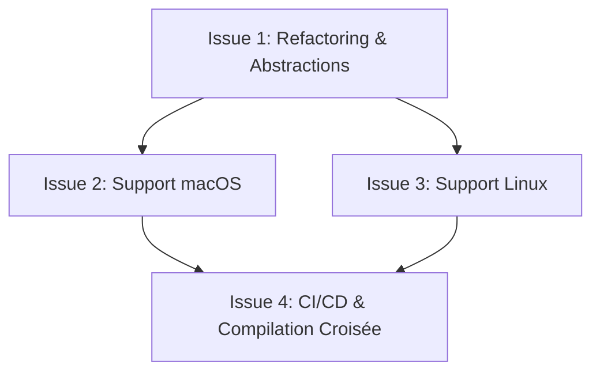

# Epic : Portage de Thoth sur Linux et macOS (Apple)

**Statut :** Réalisé (v1.1.0)  
**Responsable :** Équipe de développement  
**Description :** Cette Epic englobe tout le travail nécessaire pour rendre l'application Thoth (gestionnaire et injecteur de texte LLM par raccourcis globaux) compatible avec Linux et macOS, en migrant les fonctionnalités dépendantes de Windows vers des solutions multiplateformes robustes.

---

## 🎯 Objectifs de l'Epic
1. **Multiplateforme :** Rendre le codebase de Thoth compilable et exécutable de manière transparente sous Windows, macOS (Intel & Apple Silicon) et Linux (X11 & Wayland).
2. **Parité fonctionnelle :** Assurer que les raccourcis clavier globaux, la capture du texte sélectionné, la requête LLM, l'affichage de l'interface graphique egui et la réécriture du presse-papier fonctionnent sur chaque OS.
3. **Sécurité & Intégration :** Respecter les standards de stockage de configuration sécurisés propres à chaque système (Keychain/Secret Service, dossiers `~/.config` et `Application Support`).

## 🔒 Consignes de Sécurité et Skills Requises pour l'Agent

L'agent de développement chargé de ce portage **doit obligatoirement utiliser les compétences (Skills) suivantes** durant son exécution :

1. **`scan_dependencies` :** *CRITIQUE.* Doit être exécuté **avant** d'importer de nouvelles dépendances (comme `directories`, `rfd` ou `keyring`) dans `Cargo.toml`.
2. **`determine-threat-model` :** Établir le modèle de menace lié à la transition multiplateforme (ex. stockage des configurations locales).
3. **`create-security-implementation-plan` :** Préparer un plan d'implémentation de la sécurité pour guider les modifications.
4. **`run-security-scanner` :** Exécuter le scanner sur le code réfactoré afin de garantir l'absence de vulnérabilités et de secrets en clair sur l'ensemble des plateformes.
5. **`mandatory-secure-web-skills` :** Veiller à ce que l'accès au réseau et le stockage des données sensibles respectent les règles de sécurité.

---

## 🗺️ Liste des Issues (Tickets)

### [Issue #1] Réfactoring d'Abstraction et Nettoyage Win32
* **Type :** Tech Debt / Refactoring  
* **Priorité :** Critique  
* **Description :**  
  Préparer le projet en extrayant et isolant les composants spécifiques à Windows dans des modules conditionnels (`#[cfg(windows)]`) et introduire des bibliothèques multiplateformes pour les composants non-OS dépendants.
* **Tâches techniques :**
  1. Remplacer la gestion des boîtes de dialogue de crash `MessageBoxW` par la bibliothèque multiplateforme `rfd` (Rust File Dialogs).
  2. Remplacer le calcul personnalisé de `Config::path()` par l'utilisation de la caisse standard `directories` pour gérer proprement les dossiers utilisateurs de chaque système.
  3. Abstraire les appels à `GetAsyncKeyState` dans `src/clipboard.rs` pour que la simulation multiplateforme ne bloque pas sur les systèmes non-Windows.
  4. Encapsuler la vérification de signature Authenticode `WinVerifyTrust` dans `src/main.rs` sous un bloc `#[cfg(windows)]`.
* **Critères d'acceptation :**
  * Le projet compile toujours et fonctionne parfaitement sous Windows.
  * Les dépendances Windows (`winresource`, `winreg`, `windows-sys`) sont strictement limitées à la cible `cfg(windows)`.
  * Le projet peut être compilé sous Linux/macOS (même si les raccourcis clavier globaux n'y sont pas encore fonctionnels).

---

### [Issue #2] Implémentation du Support macOS (Apple)
* **Type :** Feature  
* **Priorité :** Haute  
* **Dépendance :** [Issue #1]  
* **Description :**  
  Adapter les raccourcis clavier globaux, la gestion du presse-papier et le stockage de la configuration aux spécificités de macOS.
* **Tâches techniques :**
  1. Adapter le module de raccourcis globaux pour supporter macOS (en utilisant `global-hotkey` ou l'API Carbon).
  2. Adapter la simulation de touches dans `src/clipboard.rs` pour utiliser la touche `Command` (`MetaLeft`/`MetaRight` dans `rdev`) à la place de `Control` pour le copier-coller.
  3. Implémenter la persistence de la configuration dans `~/Library/Application Support/Thoth/config.toml`.
  4. Implémenter le stockage sécurisé des secrets d'API via le Keychain macOS avec la caisse `keyring`.
  5. Implémenter l'auto-start en générant un fichier PLIST dans `~/Library/LaunchAgents/`.
* **Critères d'acceptation :**
  * L'application tourne en arrière-plan sous macOS.
  * L'utilisateur peut copier, traiter et coller du texte avec les raccourcis globaux adaptés à macOS.
  * L'icône de la barre d'état (System Tray) s'affiche et réagit correctement.

---

### [Issue #3] Implémentation du Support Linux (X11 & Wayland)
* **Type :** Feature  
* **Priorité :** Haute  
* **Dépendance :** [Issue #1]  
* **Description :**  
  Mettre en place le support Linux en prenant en compte les différences entre les serveurs graphiques X11 et Wayland.
* **Tâches techniques :**
  1. Implémenter la détection et les raccourcis sous Linux (via `global-hotkey` pour X11).
  2. Mettre en place la persistence de la configuration dans `~/.config/thoth/config.toml` (XDG Specification).
  3. Intégrer le support de `keyring` / D-Bus Secret Service pour chiffrer les secrets d'API.
  4. Implémenter le démarrage automatique en écrivant un fichier `.desktop` dans `~/.config/autostart/`.
  5. Rédiger une notice explicative pour les utilisateurs sous Wayland détaillant comment associer la CLI `thoth --prompt` à un raccourci global natif de leur environnement de bureau (GNOME, KDE, etc.).
* **Critères d'acceptation :**
  * Thoth fonctionne sous Linux (X11) avec les raccourcis globaux.
  * Sous Wayland, la console d'instruction (`--prompt`) peut être invoquée manuellement via la CLI et remplace correctement le texte.

---

### [Issue #4] Pipeline CI/CD Multiplateforme & Compilation Croisée
* **Type :** DevOps / Infrastructure  
* **Priorité :** Moyenne  
* **Dépendance :** [Issue #2], [Issue #3]  
* **Description :**  
  Mettre à jour l'intégration continue pour automatiser les tests et la génération de releases de Thoth pour Windows, Linux et macOS.
* **Tâches techniques :**
  1. Mettre à jour `.github/workflows/ci.yml` pour ajouter des cibles de builds pour `ubuntu-latest` et `macos-latest`.
  2. Configurer le build de releases pour produire un binaire Linux (`tar.gz` ou `.deb`) et un binaire macOS (idéalement signé/notarisé ou sous forme d'application `.app` zippée).
  3. Ajouter des tests automatisés vérifiant que les configurations par défaut se chargent correctement sur chaque plateforme.
* **Critères d'acceptation :**
  * Chaque commit sur la branche principale déclenche les builds de validation sur Windows, Linux et macOS.
  * La création d'une release GitHub publie automatiquement les exécutables compilés pour les trois plateformes.
