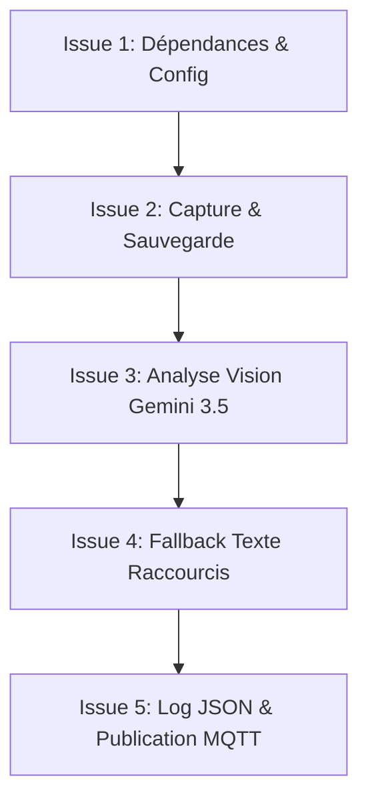

# Epic : Analyse Visuelle de Fenêtre et Publication MQTT

**Statut :** Planifié  
**Responsable :** Agent de développement  
**Description :** Cette Epic décrit l'implémentation d'une fonctionnalité d'analyse d'écran par raccourci clavier global dans Thoth. L'application devra capturer la fenêtre active, envoyer l'image à Gemini 3.5 Flash via Pylos pour y répondre aux questions, stocker la capture et journaliser le résultat de manière structurée pour de futures analyses, puis publier la réponse sur un broker MQTT.

---

## 🎯 Objectifs de l'Epic
1. **Raccourci clavier dédié :** Déclencher la capture via un raccourci global par défaut `Ctrl+Shift+Win+P` (configurable).
2. **Double stratégie d'analyse :** Prioriser l'analyse de l'image de la fenêtre (Vision) et basculer sur l'extraction de tout le texte (Sélection/Copie globale) en cas de besoin.
3. **Optimisation des réponses :** Traiter le prompt pour n'obtenir que le préfixe de la bonne réponse (Lettre/Numéro) ou une réponse très concise.
4. **Traçabilité & Domotique :** Journaliser en JSON structuré toutes les étapes et pousser le résultat sur MQTT.

## 🔒 Consignes de Sécurité et Skills Requises pour l'Agent

L'agent de développement chargé d'implémenter cette Epic **doit obligatoirement utiliser les compétences (Skills) suivantes** avant et pendant l'écriture du code :

1. **`scan_dependencies` :** *CRITIQUE.* Doit être exécuté **avant** d'importer ou d'ajouter de nouvelles dépendances (`xcap`, `rumqttc`, `rust-s3`, `keyring`, etc.) dans `Cargo.toml`. C'est l'autorité exclusive pour valider la sécurité des paquets et confirmer les versions approuvées.
2. **`determine-threat-model` :** Construire le modèle de menace pour les nouveaux flux de données d'images et de messages réseau MQTT afin d'identifier les frontières de confiance.
3. **`create-security-implementation-plan` :** Préparer un plan d'implémentation de la sécurité pour guider l'écriture du code (notamment sur l'intégration sécurisée de `keyring` et la validation TLS).
4. **`run-security-scanner` :** Exécuter le scanner de sécurité sur les modifications des fichiers source afin de s'assurer qu'aucun secret (comme les identifiants MinIO/MQTT de Joseph) n'a été hardcodé et qu'aucune vulnérabilité n'est introduite.
5. **`mandatory-secure-web-skills` :** Appliquer strictement les règles de codage sécurisé concernant le chiffrement TLS/SSL obligatoire et la manipulation des buffers d'images.

---

## 🗺️ Découpage des Issues pour l'Agent de Développement

### [Issue #1] Dépendances, Configuration et Paramétrage
* **Type :** Tâche Technique / Setup  
* **Priorité :** Critique  
* **Description :**  
  Ajouter les dépendances nécessaires au projet et enrichir les structures de configuration de Thoth pour supporter le stockage local et le client MQTT.
* **Tâches techniques :**
  1. Ajouter les dépendances dans `Cargo.toml` : `xcap`, `rumqttc`, `base64`, `rust-s3` (ou `aws-sdk-s3` pour l'upload MinIO), et `keyring` (pour la sécurité des identifiants).
  2. Enrichir `src/config.rs` pour inclure la configuration MQTT (avec le broker par défaut `mqtt-emqx.p.zacharie.org` et le login `joseph`), les paramètres MinIO S3 (endpoint `https://minio-170-api.zacharie.org` et bucket `thoth-screenshots`), ainsi que les chemins de personnalisation.
  3. Mettre à jour l'interface graphique de configuration de Thoth dans `src/gui.rs` pour permettre à l'utilisateur de modifier ces nouveaux paramètres.
  4. Configurer le scan de secrets **GitLeaks** dans le workflow GitHub Actions (`.github/workflows/ci.yml`) et documenter l'usage des pre-commit hooks locaux.
* **Critères d'acceptation :**
  * Le projet compile avec les nouvelles dépendances.
  * Les options MQTT, MinIO S3 et de chemins locaux apparaissent dans l'éditeur de configuration de l'application et sont correctement sauvegardées.

---

### [Issue #2] Capture de la Fenêtre Active et Conservation Locale
* **Type :** Feature  
* **Priorité :** Haute  
* **Dépendance :** [Issue #1]  
* **Description :**  
  Implémenter la capture d'écran de la fenêtre active au moment du déclenchement du raccourci et sa sauvegarde sur le disque.
* **Tâches techniques :**
  1. Utiliser le crate `xcap` pour lister les fenêtres à l'écran, identifier celle ayant le focus au premier plan et en capturer le buffer d'image PNG.
  2. Implémenter la sauvegarde temporaire locale du fichier PNG, puis téléverser l'image sur le bucket MinIO S3 `thoth-screenshots` à l'adresse `https://minio-170-api.zacharie.org` en chargeant l'Access Key `joseph` et la Secret Key depuis la variable d'environnement `MINIO_SECRET_KEY` (configurée dans le fichier `.env` local).
  3. Obtenir l'URL d'accès ou le chemin d'accès S3 distant pour l'étape de journalisation, puis purger ou archiver le fichier local selon les règles de rétention.
* **Critères d'acceptation :**
  * L'appui sur le raccourci génère une capture PNG de la fenêtre active.
  * L'image est stockée avec succès sur le stockage distant MinIO S3 sous la forme `screenshot_[session_id]_[timestamp].png`.
  * La clé secrète MinIO n'est pas codée en dur dans le dépôt Git.

---

### [Issue #3] Analyse Vision par LLM Gemini 3.5 Flash et Prompt Optimisé
* **Type :** Feature  
* **Priorité :** Haute  
* **Dépendance :** [Issue #2]  
* **Description :**  
  Encoder l'image capturée et exécuter l'appel API vers la passerelle Pylos avec le modèle `gemini-3.5-flash` et un prompt hautement optimisé.
* **Tâches techniques :**
  1. Encoder l'image PNG sauvegardée en Base64.
  2. Effectuer la requête API `POST` compatible OpenAI vers la passerelle Pylos en ciblant le modèle `gemini-3.5-flash` avec l'image en tant que contenu multimodal.
  3. Appliquer le prompt système optimisé :
     > *"Analyse cette image de fenêtre. Identifie les questions posées. Pour chaque question, trouve la réponse correcte. Si les choix de réponse comportent un préfixe (comme une lettre A, B, C... ou un numéro 1, 2, 3...), renvoie UNIQUEMENT la lettre ou le numéro correspondant à la réponse correcte. Sinon, renvoie la réponse sous la forme la plus concise possible. Ne fournis aucune phrase d'introduction ni explication."*
* **Critères d'acceptation :**
  * La requête multimodal est envoyée et traitée avec succès.
  * Si la question comporte des choix multiples préfixés, la réponse extraite du LLM ne contient que le préfixe (ex. "B" ou "3").

---

### [Issue #4] Mécanisme de Repli (Fallback) par Sélection et Copie de Texte
* **Type :** Feature  
* **Priorité :** Moyenne  
* **Dépendance :** [Issue #3]  
* **Description :**  
  Mettre en place un mécanisme de repli textuel si l'analyse de l'image ne détecte aucune question ou renvoie une erreur.
* **Tâches techniques :**
  1. Analyser le retour de l'étape 3. Si aucun texte ou question n'est détecté, déclencher la stratégie de repli.
  2. Simuler séquentiellement l'appui sur les touches de sélection globale (`Ctrl+A` / `Cmd+A`) puis de copie (`Ctrl+C` / `Cmd+C`) sur la fenêtre active.
  3. Extraire le texte brut copié depuis le presse-papier de l'application.
  4. Envoyer ce texte brut à Pylos/LLM avec le même prompt optimisé pour l'extraction et la résolution de questions.
* **Critères d'acceptation :**
  * En cas d'échec de la vision, Thoth simule les touches pour copier le texte de la fenêtre active et réalise l'analyse textuelle avec succès.

---

### [Issue #5] Journalisation JSON Structurée et Publication MQTT
* **Type :** Feature  
* **Priorité :** Haute  
* **Dépendance :** [Issue #3], [Issue #4]  
* **Description :**  
  Consigner le résultat complet pour des analyses ultérieures et diffuser la réponse par message MQTT.
* **Tâches techniques :**
  1. Récupérer le résultat final (depuis la vision ou le fallback texte).
  2. Écrire une entrée JSON structurée dans le fichier de logs configuré (ex. `question_answers.log`), incluant : `timestamp`, `session_id`, `window_title`, `s3_url` (chemin de l'image sur MinIO), `question_detected`, `answer_proposed`.
  3. Utiliser le client `rumqttc` pour se connecter au broker MQTT par défaut `mqtt-emqx.p.zacharie.org` (port `1883`/`8883`) avec le login `joseph` et le mot de passe chargé depuis la variable d'environnement `MQTT_PASSWORD` (configurée dans le fichier `.env` local), puis publier un message JSON similaire sur le topic `thoth/answers`.
* **Critères d'acceptation :**
  * Une entrée JSON complète avec l'URL de l'image MinIO est ajoutée à chaque exécution dans les logs locaux.
  * Le message MQTT est publié sur le broker EMQX en utilisant les informations de connexion de joseph et est correctement reçu.
  * Le mot de passe MQTT n'est pas codé en dur dans le dépôt Git.
